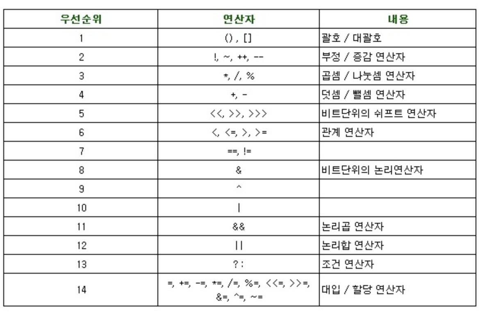

# Bit 연산자

### 연산자 우선순위 표


> `<<` : 왼쪽 Shift 연산자 
> * 연산 대상에 2의 n승을 곱한 것과 같다
> * ex) 2 << 2  : 2 * 2 * 2 (8)
> 
> <br>
>
> `>>` : 오른쪽 Shift 연산자
> * 연산 대상에 2 * n 만큼 나눈 것과 같다
> * ex) 16 >> 2 : (16 % (2 * 2)) (4)

`n개의 원소를 가지는 집합의 부분집합 갯수`는 `1 << n` 과 같다

집합을 돌면서 부분집합의 값을 얻어오는 방법

```
for(부분집합 총 갯수 i) {
    for(원소 갯수 j) {
        ((i & 1 << j) != 0) { 
        // End 연산보다 Left Shift 연산이 우선 순위가 놓고
        // End 연산보다 관계연산자가 우선순위가 높으니 소괄호로 묶어주는 것은 센스
        // 원소 갯수만큼 돌껀데, i 값(ex.1011) 의 모든 자릿수를 탐색하며 End연산이 1인 즉, Bit가 올라가있는 녀석을 Append 해줄 것이다.
            //..........
        }
    }
}
```
